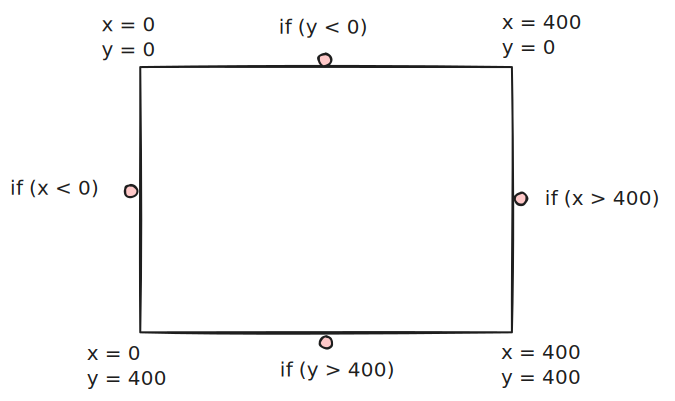
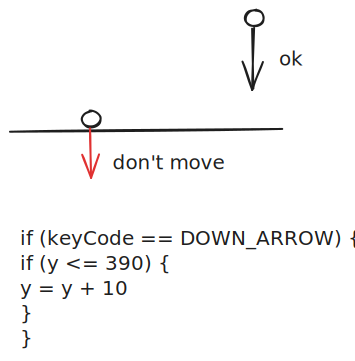
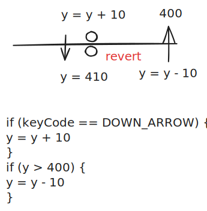
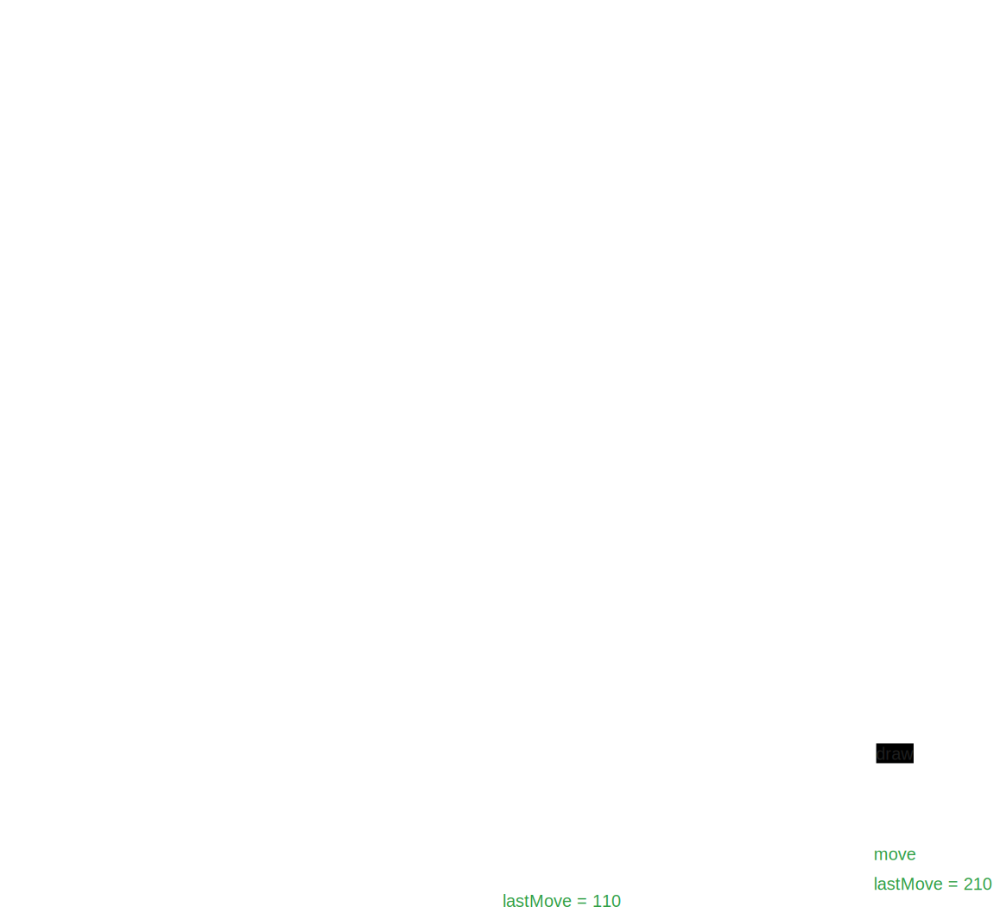

Di bagian sebelumnya, kita sudah belajar bagaimana mengubah variable dengan menerima input dari keyboard (user input).

```javascript
function setup() {
  createCanvas(400, 400);
}

let x = 0;
function draw() {
  background(220);
  textSize(60);
  text("🤖", x, 100);
}

function keyPressed() {
  x = x + 10;
}
```

<iframe src="conditional/0-single-direction.html" width="400px" height="400px"></iframe>

Namun, robot di atas selalu bergerak ke kanan, walaupun kita tekan tombol kiri atau tombol lainnya. Bagaimana supaya agar hanya bergerak ke kanan jika tombol kanan ditekan?

## `if` statement

- Gerak ke kanan **jika** tombol kanan ditekan

Kata **jika** di atas adalah kata kunci yang menandakan kita akan menggunakan conditional. Conditional membuat sebuah code hanya dijalankan **jika** kondisi tertentu terpenuhi.

```javascript
function keyPressed() {
  //check apakah tombol kanan ditekan
  if (tombolKananDitekan) {
    // hanya dieksekusi jika tombol kanan ditekan
    x = x + 10;
  }
}
```

Bagaimana untuk mengecek apakah tombol kiri atau kanan ditekan? Kita bisa menggunakan variable `keyCode` yang sudah disediakan oleh p5.js. Mari kita coba `console.log` variable `keyCode` dahulu

```javascript
function keyPressed() {
  console.log(keyCode);
}
```

<iframe src="conditional/1-key-code.html" width="400px" height="400px"></iframe>

Tekan tombol kiri dan kanan, lalu lihat hasilnya di console. Apa keycode untuk tombol kiri dan kanan?

Yap, keycode untuk tombol kanan adalah 39. Mari kita gunakan:

```javascript
function keyPressed() {
  if (keyCode === 39) {
    x = x + 10;
  }
}
```

<iframe src="conditional/2-strict-right.html" width="400px" height="400px"></iframe>

Nah, sekarang robot hanya bergerak ke kanan jika tombol kanan ditekan. Dan robot tidak bergerak jika tombol lainnya ditekan.

## `else if` statement

Bagaimana jika kita ingin robot bisa bergerak ke kiri juga?

- Gerak ke kiri **jika** tombol kiri ditekan
- Gerak ke kanan **jika** tombol kanan ditekan

Kita bisa gunakan `else if`

```javascript
function keyPressed() {
  //check apakah tombol kiri ditekan
  if (tombolKiriDitekan) {
    // hanya dieksekusi jika tombol kiri ditekan
    x = x - 10;
  } else if (tombolKananDitekan) {
    // hanya dieksekusi jika tombol kanan ditekan
    x = x + 10;
  }
}
```

`keyCode` untuk tombol kiri adalah 37. Mari kita gunakan:

```javascript
function keyPressed() {
  if (keyCode === 37) {
    x = x - 10;
  } else if (keyCode === 39) {
    x = x + 10;
  }
}
```

<iframe src="conditional/3-left-right.html" width="400px" height="400px"></iframe>

## Task 1 📝: Moving Up & Down

Buat supaya bisa gerak ke atas dan ke bawah juga

<iframe src="conditional/4-left-right-up-down.html" width="400px" height="400px"></iframe>

## Bonus

Susah juga ya mengingat keyCode? Ada kah cara lebih praktis?

Ada! p5js sudah menyediakan `const` untuk keycode. Kita bisa gunakan `UP_ARROW`, `DOWN_ARROW`, `LEFT_ARROW`, dan `RIGHT_ARROW` untuk menggantikan `keyCode === 38`, `keyCode === 40`, `keyCode === 37`, dan `keyCode === 39`.

```javascript
function keyPressed() {
  if (keyCode === LEFT_ARROW) {
    x = x - 10;
  } else if (keyCode === RIGHT_ARROW) {
    x = x + 10;
}
```

## `else` statement

Program sekarang sudah bisa bergerak ke atas, ke bawah, ke kiri, dan ke kanan. Tapi bagaimana jika tombol lainnya ditekan? Robot tidak bergerak.

Nah, sekarang kita ingin robot berubah jadi 👾 jika tombol lainnya ditekan.

```javascript
function keyPressed() {
  if (keyCode === LEFT_ARROW) {
    x = x - 10;
  } else if (keyCode === RIGHT_ARROW) {
    x = x + 10;
  } else if (keyCode === UP_ARROW) {
    y = y - 10;
  } else if (keyCode === DOWN_ARROW) {
    y = y + 10;
  } else if (keyCode == ALT) {
    emoji = "👾";
  } else if (keyCode == CONTROL) {
    emoji = "👾";
  } else if (keyCode == SHIFT) {
    emoji = "👾";
  } else if (keyCode == BACKSPACE) {
    emoji = "👾";
  }
  // dst
  // waduh capek
}
```

Waduh, banyak sekali `else if`, kita harus menulis banyak sekali code. Ada cara lebih praktis?

Ada! Kita bisa gunakan `else` statement. `else` statement akan dieksekusi jika semua kondisi di atasnya tidak ada yang terpenuhi.

- Gerak ke atas **jika** tombol atas ditekan
- Gerak ke bawah **jika** tombol bawah ditekan
- Gerak ke kiri **jika** tombol kiri ditekan
- Gerak ke kanan **jika** tombol kanan ditekan
- Ubah emoji jadi 👾 **jika** jika **semua kondisi di atas tidak terpenuhi**

```javascript
function keyPressed() {
  if (keyCode === LEFT_ARROW) {
    x = x - 10;
  } else if (keyCode === RIGHT_ARROW) {
    x = x + 10;
  } else if (keyCode === UP_ARROW) {
    y = y - 10;
  } else if (keyCode === DOWN_ARROW) {
    y = y + 10;
  } else {
    emoji = "👾";
  }
}
```

## Task 2 📝: Handling Other

Lengkapi program di atas supaya bisa bergerak ke atas, ke bawah, ke kiri, dan ke kanan, dan ubah emoji jadi 👾 jika tombol lainnya ditekan.

<iframe src="conditional/5-else.html" width="400px" height="400px"></iframe>

## Nested If

Waduh, emoji-nya jadi 👾 terus. Bagaimana jika kita ingin mengubahnya lagi jadi 🤖 kalau tombol selain itu ditekan berkali-kali?

Kita bisa menaruh `if` di dalam `else` statement. Ini disebut dengan `nested if`.

```javascript
function keyPressed() {
  if (keyCode === LEFT_ARROW) {
    x = x - 10;
  } else if (keyCode === RIGHT_ARROW) {
    x = x + 10;
  } else if (keyCode === UP_ARROW) {
    y = y - 10;
  } else if (keyCode === DOWN_ARROW) {
    y = y + 10;
  } else {
    if (emoji === "👾") {
      emoji = "🤖";
    } else {
      emoji = "👾";
    }
  }
}
```

<iframe src="conditional/6-nested-if.html" width="400px" height="400px"></iframe>

## Boundary Check

Gerakkan terus robotnya sampai ke ujung layar, robot akan menghilang!

Buat supaya robotnya tidak bisa bergerak ketika sudah di ujung layar.

<iframe src="conditional/7-nested-if-boundary-check.html" width="400px" height="400px"></iframe>

Tips: bisa gunakan `width` dan `height` untuk mengecek koordinat ujung layar.

Ada 4 kemungkinan kondisi:

- Jika robot bergerak ke kiri, dan sudah di ujung layar kiri
- Jika robot bergerak ke kanan, dan sudah di ujung layar kanan
- Jika robot bergerak ke atas, dan sudah di ujung layar atas
- Jika robot bergerak ke bawah, dan sudah di ujung layar bawah

Seperti di ilustrasi di bawah ini, yang warna merah adalah kondisi di luar boundary.



Untuk mencegah itu, ada 2 solusi:

### Preventive

Jangan biarkan robot keluar dari boundary



### Corrective

Biarkan robot keluar dari boundary, tapi kembalikan ke boundary



## Task 3 📝: Off-grid Prevention

Buatlah program supaya robot tidak bisa keluar dari layar menggunakan cara preventif

## Task 4 📝: Off-grid Correction

Buatlah program supaya robot tidak bisa keluar dari layar menggunakan cara corrective

## Apple

Tidak seru ya robotnya hanya bergerak-bergerak saja. Bagaimana jika kita tambahkan apel yang bisa dimakan oleh robot?

Posisi apel bisa kita simpan di variable `appleX` dan `appleY`. Kita bisa gunakan `random` untuk membuat posisi apel acak.

```javascript
let appleX;
let appleY;

let robotX = 200;
let robotY = 200;

function setup() {
  createCanvas(400, 400);

  // math calculation di sini untuk membuat posisi apel acak tapi kelipatan 10
  appleX = Math.floor(random(width / 10)) * 10;
  appleY = Math.floor(random(height / 10)) * 10;
}

function draw() {
  background(220);
  textSize(60);
  text("🤖", robotX, robotY);
  text("🍎", appleX, appleY);
}

function keyPressed() {
  if (keyCode === LEFT_ARROW) {
    robotX = robotX - 10;
  } else if (keyCode === RIGHT_ARROW) {
    robotX = robotX + 10;
  } else if (keyCode === UP_ARROW) {
    robotY = robotY - 10;
  } else if (keyCode === DOWN_ARROW) {
    robotY = robotY + 10;
  }
}
```

<iframe src="conditional/8-apple.html" width="400px" height="400px"></iframe>

## Task 5 📝: Eating Apple

Buat supaya apelnya bisa dimakan oleh robot. Jika robot menyentuh apel, apel akan pindah ke posisi acak.

<iframe src="conditional/9-apple-eaten.html" width="400px" height="400px"></iframe>

## Moving Apple

Kalau apelnya diam saja, tidak seru sih ya.

Buat supaya apelnya bergerak-gerak juga, tapi geraknya jangan lompat-lompat ya. Kalau lompat-lompat, sulit nanti robotnya menangkapnya.

Apel cuma boleh bergerak ke atas, ke bawah, ke kiri, atau ke kanan 10 langkah. Gerakkannya acak.

Hint: bisa gunakan `random([-10, 0, 10])` untuk membuat gerakan acak, output dari itu hanya bisa -10, 0, atau 10.

Kenapa 0? Karena boleh donk apelnya diam saja. Kalau selalu gerak, sulit nanti robotnya menangkapnya.



```javascript
let lastAppleMoveTime = 0;
function draw() {
  background(220);
  textSize(60);
  text("🤖", robotX, robotY);
  text("🍎", appleX, appleY);

  if (millis() - lastAppleMoveTime > 1000) {
    appleX = random([-10, 0, 10]) + appleX;
    appleY = random([-10, 0, 10]) + appleY;

    lastAppleMoveTime = millis();
  }
}
```

<iframe src="conditional/10-apple-move.html" width="400px" height="400px"></iframe>

## Task 6 📝: On-grid Apple

Waduh, apelnya bisa keluar dari layar. Bagaimana jika kita ingin apelnya tidak bisa keluar dari layar?

Dan coba main-main, buat apelnya bisa bergerak lebih cepat

<iframe src="conditional/11-apple-boundary.html" width="400px" height="400px"></iframe>

## Task 7 📝: Non-diagonal Apple

Wah apelnya curang, bisa bergerak diagonal. Buat supaya apelnya hanya bisa bergerak ke atas, ke bawah, ke kiri, atau ke kanan saja.

<iframe src="conditional/12-apple-no-diagonal.html" width="400px" height="400px"></iframe>
