# Vibe Coding 2025

---

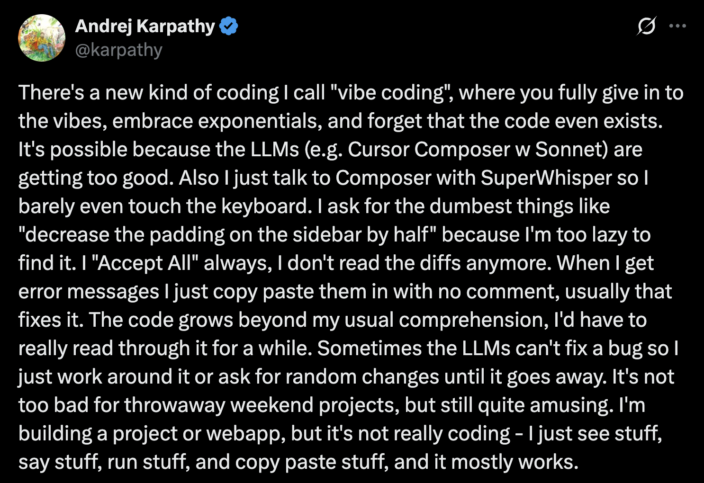

# How We Got Here

---

## Syntax Highlighting

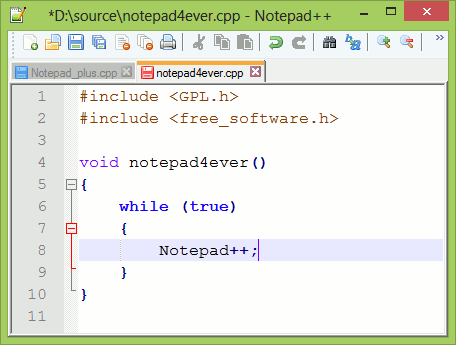

## Autocomplete

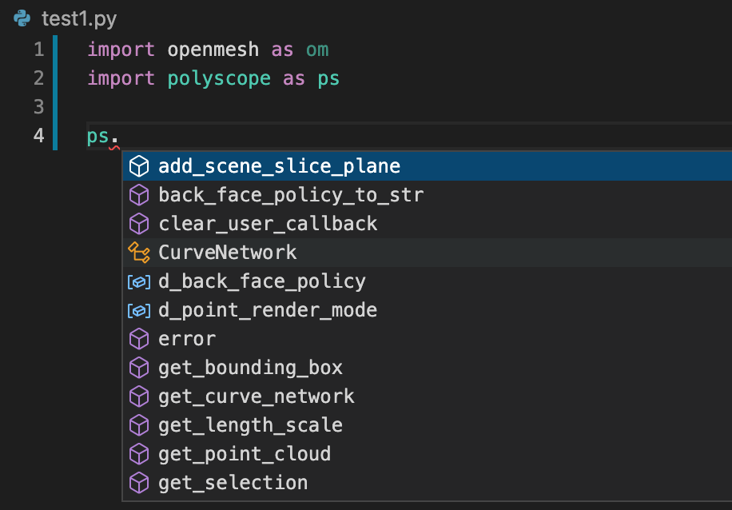

## AI Does the Typing

<video controls width="100%">
  <source src="https://code.visualstudio.com/assets/docs/copilot/inline-suggestions/nes-video.mp4" type="video/mp4">
  Your browser does not support the video tag.
</video>

## Inline Chat


## Mind Reading Code

<video controls width="100%">
  <source src="https://cursor.com/assets/landing/tab-video-dark.mp4" type="video/mp4">
  Your browser does not support the video tag.
</video>

# Enter the Agents

---

<video controls width="100%">
  <source src="https://code.visualstudio.com/assets/docs/copilot/overview/agent-mode-blog-video.mp4" type="video/mp4">
  Your browser does not support the video tag.
</video>

---

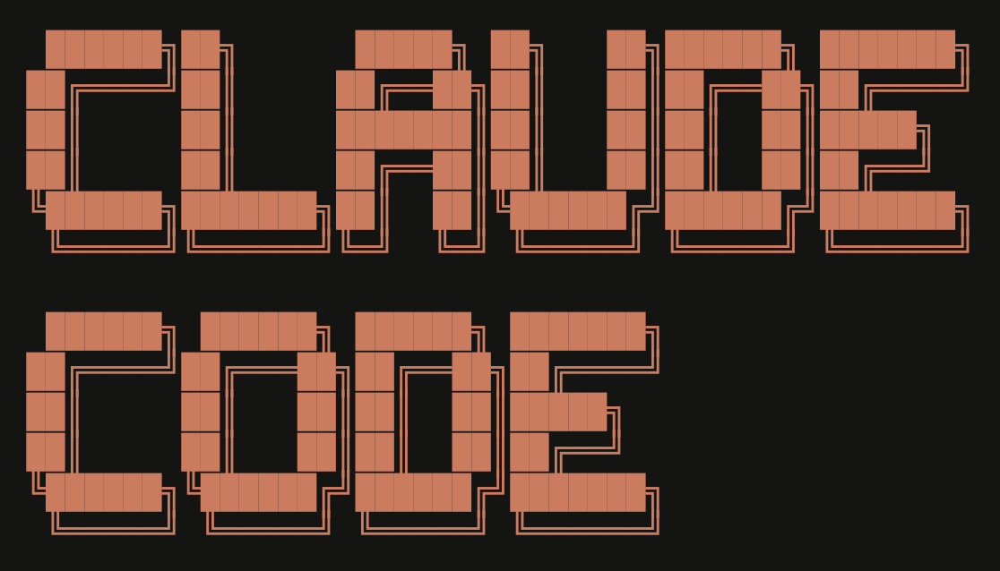

# Why Claude Code?

## The Hype is Real

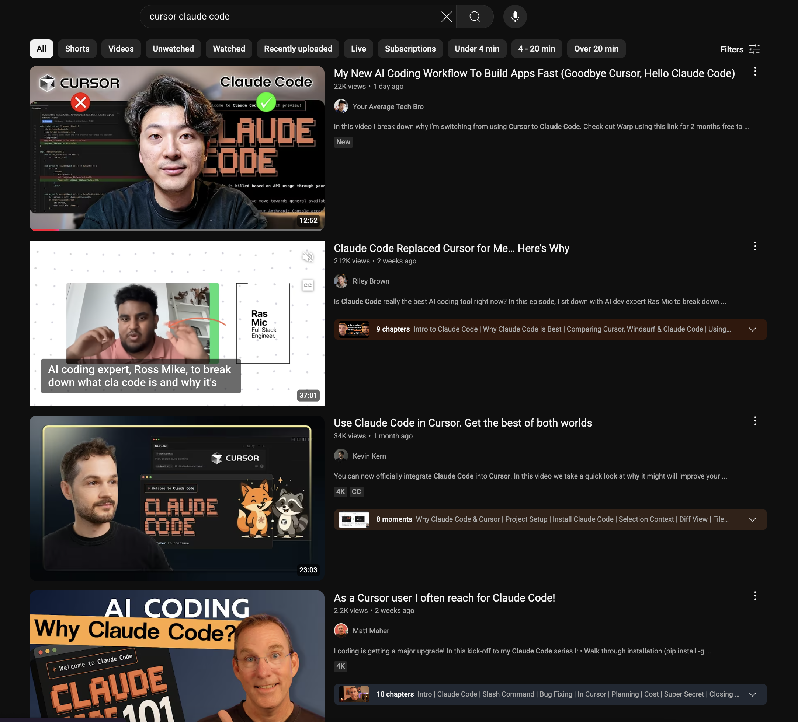

## No Surprise Bills

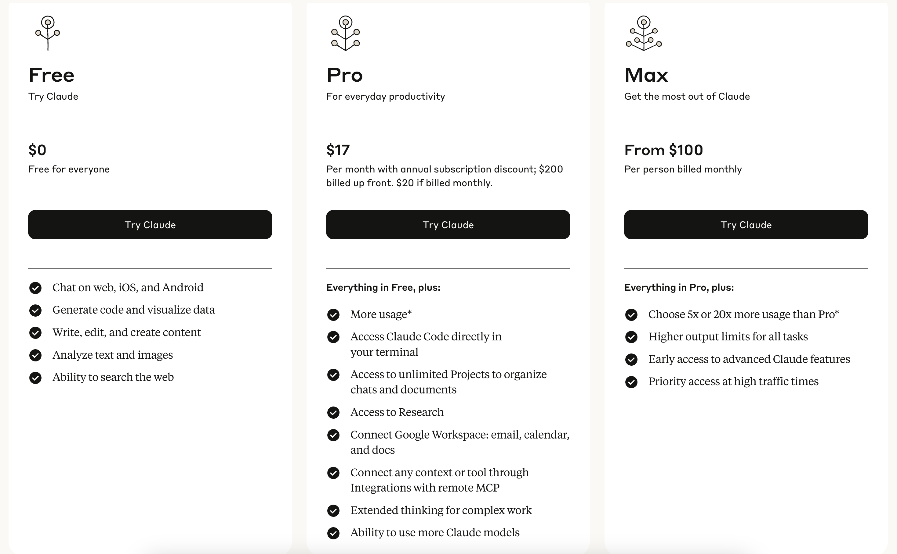

# Claude Code Basics

## Start Here: `/init`

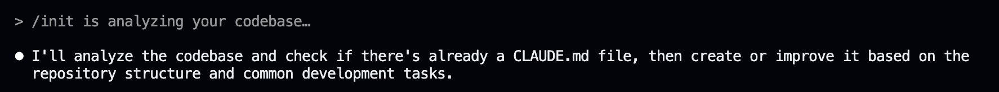

## Set Permissions: `/permission`

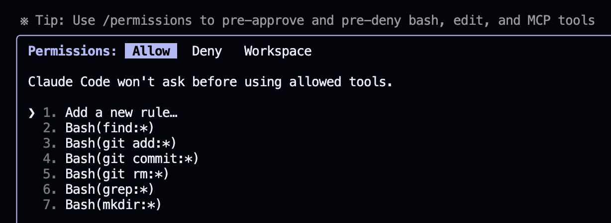

## Works with Your Editor: `/ide`

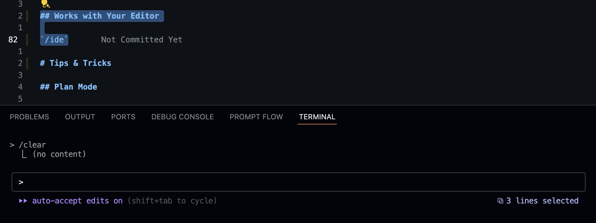

# Tips & Tricks

## Prompts

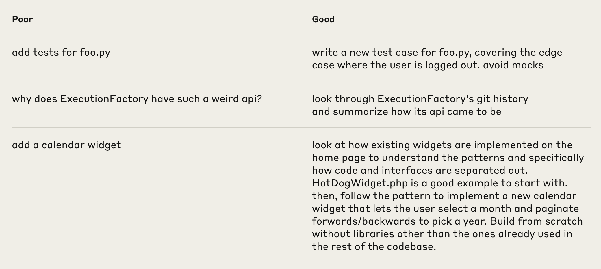

## Think Harder

- `Think`
- `Think hard`
- `Think harder`
- `Ultrathink`

## Plan Mode

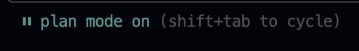

## Write Tests First/Later

- Catch bugs early
- Tests are easy now
- No excuses!

## Work on Multiple Things

**Git worktree** lets you work on multiple branches

<!-- Embed: animation about git worktree -->

<iframe src="animations/git-worktree.html" width="100%" height="450" frameborder="0" style="border-radius: 8px;"></iframe>

## Make Your Own Commands

`.claude/commands/*.md`

Use **`#$ARGUMENTS`** for dynamic values

## Send Screenshots

Just drag images into chat

## Stop Early, Save Time

- Plan first
- Stop when you know what's happening

## Save Your Work

Commit often or at least `git add` your work

## `/clear`

Clears chat context when you need a fresh start

# MCP

[Curated List](https://code.visualstudio.com/mcp)

- Context7
- Playwright
- Convex

## Config: `.mcp.json`

```json
{
  "mcpServers": {
    "playwright": {
      "type": "stdio",
      "command": "npx",
      "args": ["@playwright/mcp@latest"],
      "env": {}
    },
    "context7": {
      "type": "stdio",
      "command": "npx",
      "args": ["-y", "@upstash/context7-mcp"],
      "env": {}
    }
  }
}
```

## Database MCP

# Git

## GH CLI

`gh` commands work out of the box

<!-- Example: gh commands -->

```bash
# Create a PR
gh pr create --title "Add dark mode" --body "Implements dark theme toggle"

# Review PRs
gh pr list
gh pr view 42
gh pr checkout 42

# Manage issues
gh issue create --title "Bug in login" --body "Users can't sign in"
gh issue list --assignee @me
```

## Easy Commits

Just say `commit`

## Easy PRs

Just say `/pr` (custom command)

# What You Can Build

## Ask About Your Code

<!-- Example: AI prompt to explain a code snippet -->

```
"What does this function do?"

"Explain this regex pattern: /^[a-zA-Z0-9._%+-]+@[a-zA-Z0-9.-]+\.[a-zA-Z]{2,}$/"

"Why is this code slow and how can I optimize it?"

"What are the potential security issues in this authentication flow?"
```

## Make Presentations

<!-- Example: AI prompt to improve markdown based presentation -->

```
"Make this presentation more engaging and add interactive examples"

"Convert these bullet points into a story format"

"Add code examples to demonstrate each concept"

"Create animations to visualize this workflow"
```

## Build Quick Prototypes

<!-- Example: AI prompt to build a prototypes-->

```
"Build a simple todo app with React and local storage"

"Create a REST API for a blog with authentication"

"Make a real-time chat app using WebSockets"

"Build a file upload component with drag and drop"
```

## Documentation

<!-- Example: AI prompt to generate documentation from code -->

```
"Generate API documentation for these endpoints"

"Create a README for this project with setup instructions"

"Write JSDoc comments for all these functions"

"Generate a changelog from git commits"
```

## Clean Up Your Code

- Find what's broken
- Write tests first
- Ask for refactoring ideas
- Let Claude do the work
- Test everything

# The Future is Here

## Don't Just Watch

**The coding landscape is changing faster than ever**

Those who adapt and learn these tools will thrive

Those who don't... well, they'll be left behind

## Your Mission

- **Start today**
- **Build something** - Even something small
- **Share your experience** - Help others learn
- **Keep experimenting** - New tools emerge constantly

## Remember

> "The best time to plant a tree was 20 years ago. The second best time is now."

**The AI coding revolution is happening now**

**Your advantage starts today**

# Now go build something amazing
