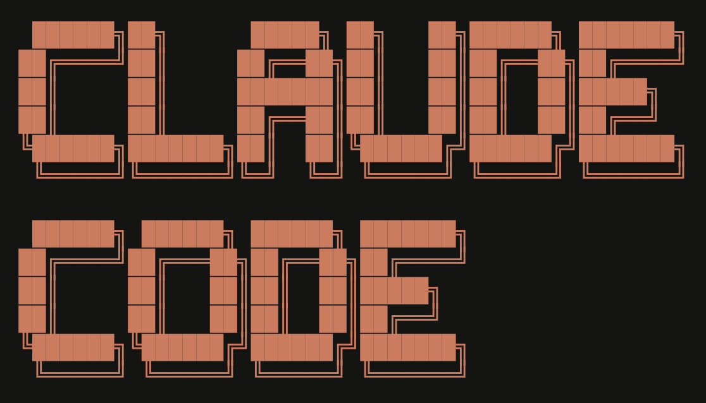

---
format:
  revealjs:
    theme: custom.scss
---

# Vibe Coding 2025

## Claude Code

# Why?

## Hype

## Flat Subscription

# 101

## `/init`

## `/permission`

CLAUDE.MD

## IDE Integration

# Tips

## Plan Mode

## Extended Thinking

- `Think`
- `Think hard`
- `Think harder`
- `Ultrathink`

## Parallel Agent

Git worktree

## Github Integration

`gh`

## TDD/Test

## Custom Slash

`#$ARGUMENTS`

## Screenshot

## Prompts

## Interrupt early

- Plan
- Interrupt

## Commit often

...or at least `git add`

## `/clear`

# MCP

https://code.visualstudio.com/mcp

- Context7
- Playwright
- Convex

## `.mcp.json`

## Database MCP

# Git

## Make a PR

`/pr`

## Always Allow

# Others

## ipynb

# Use Cases

## Code based Q & A

## Presentation

## Simulation

## Documentation

## Refactoring

- Ask what to refactor
- Make test cases first
- Ask for suggestion how to refactor
- Ask to refactor
- Retest

# My Setup

Github Copilot ($10) + Claude
